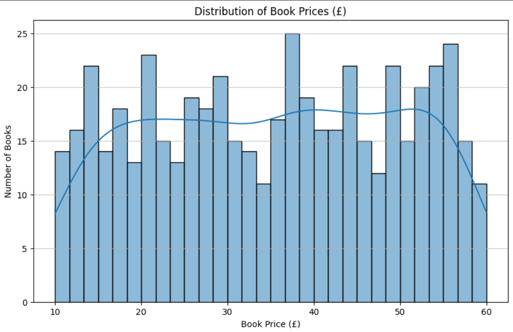
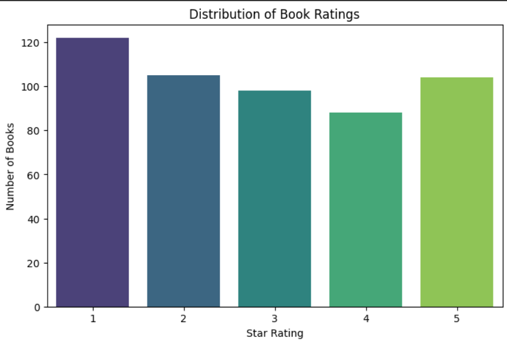
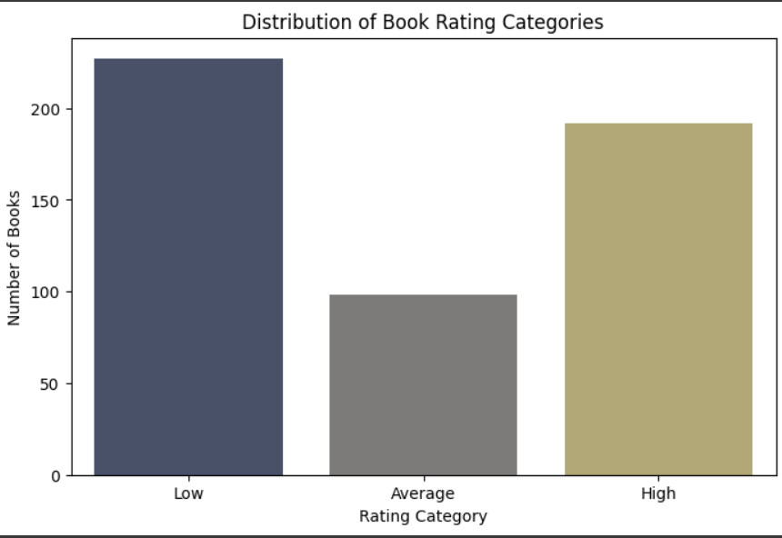
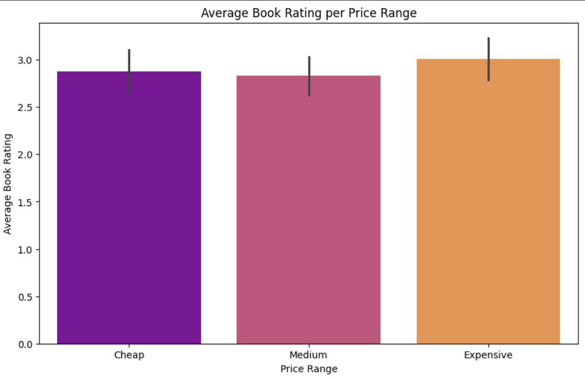

# 📚 Books-to-Scrape | Web Scraping Dataset Project

Welcome to the **Books-to-Scrape Web Scraping Dataset Project** — a beautifully organized, real-world example of how to use web scraping techniques to extract, process, and analyze product data from an e-commerce website. Whether you're a beginner or a pro, this project is crafted to impress and inspire.

---

## 🚀 Project Overview

This repository demonstrates end-to-end web scraping using Python from the [Books to Scrape](https://books.toscrape.com/) website, a mock e-commerce store used for educational purposes.

From fetching HTML content with `requests` to parsing it with `BeautifulSoup`, transforming it using `pandas`, and visualizing insights with `matplotlib` and `seaborn` — this project takes you through every important step of the data extraction and analysis process.

You’ll find **a clean dataset**, **a Google Colab notebook with detailed explanations**, and **a Python script with just the code** — all ready to be reused, repurposed, or showcased in your portfolio.

---

## 📦 Dataset Summary (`scraped_books_data.csv`)

The final dataset contains:

- **Book Name**  
- **Price (£)**  
- **Rating (1-5)**  
- **Price_Range** → `Cheap`, `Medium`, `Expensive`  
- **Rating_Category** → `Low`, `Average`, `High`

### 🔍 Sample Preview

| Book Name                     | Book Price | Book Rating | Price Range | Rating Category |
|------------------------------|------------|--------------|--------------|------------------|
| A Light in the Attic         | 51.77      | 3            | Expensive    | Average          |
| Tipping the Velvet           | 53.74      | 1            | Expensive    | Low              |
| Soumission                   | 50.10      | 1            | Expensive    | Low              |
| Sharp Objects                | 47.82      | 4            | Expensive    | High             |
| Sapiens: A Brief History ... | 54.23      | 5            | Expensive    | High             |

---

## 🧠 What's Inside?

| File/Folder                | Description |
|---------------------------|-------------|
| `Web_Scraping.ipynb`      | 📓 Google Colab Notebook with step-by-step code, comments, and analysis |
| `Web_Scraping_Dataset.py` | 🧠 Clean Python script containing only code (no comments), perfect for reuse |
| `scraped_books_data.csv`  | 📈 Final cleaned dataset with 1000 books scraped from all categories |
| `README.md`               | 📘 This file you're reading, containing project documentation |
| `A.png` to `D.png`        | 📊 Visual data analysis charts (see below) |

---

## 📊 Visual Explorations

Here’s a sneak peek into the exploratory data analysis we performed:

### A. Distribution of Book Prices



> This histogram shows how most books fall under the mid to high price range.

---

### B. Book Star Ratings Count



> A quick view into how user ratings are distributed from 1 to 5 stars.

---

### C. Rating Categories Breakdown



> Ratings grouped into `Low`, `Average`, and `High` to simplify analysis.

---

### D. Average Rating per Price Range



> Do expensive books really have better ratings? This chart helps find out.

---

## 🛠 Tools and Libraries Used

- **Python** 🐍 – Core programming language
- `requests` – Webpage fetching
- `BeautifulSoup (bs4)` – HTML parsing
- `pandas` – Data manipulation and structuring
- `matplotlib` & `seaborn` – Data visualization

---

## 📂 How to Use

1. **Clone the repository**
   ```bash
   git clone https://github.com/yourusername/Books-to-Scrape_Web_Scraping_Dataset.git
   cd Books-to-Scrape_Web_Scraping_Dataset
